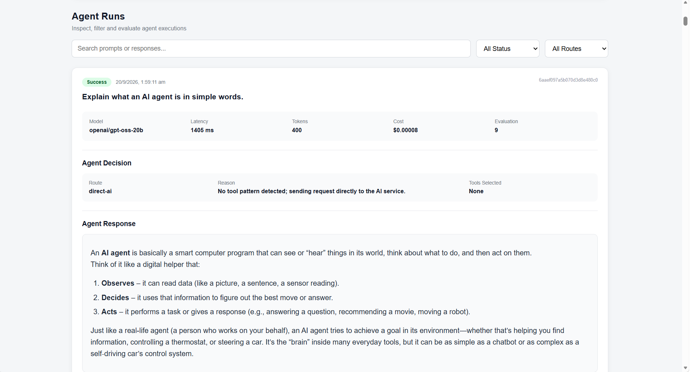
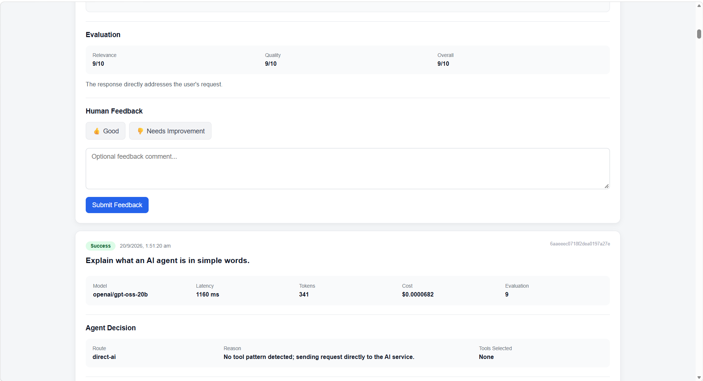

# AgentOps

### Production AI Agent Monitoring & Evaluation Platform

AgentOps is an observability platform for monitoring and evaluating AI-agent executions.

Instead of treating an AI application as a simple input → output system, AgentOps captures what happened during each run — including routing decisions, tool usage, latency, token consumption, estimated cost, evaluation results, failures, and human feedback.

### Why AgentOps?

AI agents can fail in ways that are difficult to understand from the final response alone.

AgentOps provides visibility into each execution so developers can answer questions such as:

- What decision did the agent make?
- Which tools were used?
- Did a tool fail?
- How long did the execution take?
- How many tokens were consumed?
- What was the estimated cost?
- How was the response evaluated?
- What did the human reviewer think about the result?

The goal is to make AI-agent behavior **observable, measurable, and easier to debug**.


## Tech Stack

| Layer | Technology |
|---|---|
| Frontend | React + Vite |
| Backend | Node.js + Express |
| Database | MongoDB + Mongoose |
| AI Service | Python + FastAPI |
| LLM | Groq — `openai/gpt-oss-20b` |
| API Communication | REST APIs |
| API Testing | Postman |
| Styling | CSS |
| Security | Helmet, Rate Limiting, Restricted CORS |

## Core Features

###  Agent Execution Monitoring
Tracks each AI-agent run with:
- Prompt and response
- Execution status
- Model used
- End-to-end latency
- Token usage
- Estimated cost

###  Agent Decision Tracking
Records how each request was handled:
- Direct AI execution
- Tool-based execution
- Routing reason
- Selected tools

###  Tool Execution Monitoring
Currently supports:
- Calculator tool
- Text analyzer tool
- Tool input and output tracking
- Tool success/failure status
- Individual tool latency

###  Evaluation
Each completed run receives:
- Relevance score
- Quality score
- Overall score
- Evaluation reasoning

###  Failure Monitoring
Failed AI-service requests are persisted so failures remain visible in the dashboard instead of disappearing after the request ends.

###  Human Feedback
Reviewers can mark responses as:
- Good
- Needs improvement

Optional comments are stored with the run.

###  Dashboard Analytics
The dashboard provides:
- Run search and filtering
- Success/failure visibility
- Latency analytics
- Token and cost information
- Tool usage details
- Run-level evaluation and feedback

## Architecture

AgentOps uses a modular architecture with separate frontend, backend, and AI-service layers.

```text
                    ┌─────────────────────┐
                    │   React + Vite       │
                    │     Dashboard        │
                    └──────────┬──────────┘
                               │
                               │ REST API
                               ▼
                    ┌─────────────────────┐
                    │ Node.js + Express    │
                    │      Backend         │
                    │                     │
                    │ • Routing           │
                    │ • Tool Execution    │
                    │ • Evaluation        │
                    │ • Logging           │
                    │ • Validation        │
                    └───────┬───────┬─────┘
                            │       │
                 ┌──────────┘       └──────────┐
                 ▼                             ▼
        ┌─────────────────┐          ┌─────────────────┐
        │    MongoDB      │          │ Python FastAPI  │
        │                 │          │   AI Service    │
        │ • Agent Runs    │          │                 │
        │ • Tool Calls    │          │ • Groq LLM      │
        │ • Evaluation    │          │ • AI Response   │
        │ • Feedback      │          └─────────────────┘
        └─────────────────┘
```

### Request Flow

1. An AI request is sent to the AgentOps backend API.
2. The React dashboard retrieves and visualizes persisted agent runs from the Express backend.
3. The backend validates the request and determines the execution route.
4. Required tools are executed when applicable.
5. The backend sends the AI request to the FastAPI service.
6. The FastAPI service communicates with the Groq LLM.
7. The backend collects the AI response, tool results, latency, tokens, and evaluation data.
8. The complete run is stored in MongoDB.
9. The dashboard displays the execution details and analytics.

## Project Structure

```text
AgentOps/
│
├── frontend/
│   ├── src/
│   ├── public/
│   ├── .env
│   └── package.json
│
├── backend/
│   ├── server.js
│   ├── agentRun.js
│   ├── db.js
│   ├── logger.js
│   ├── .env
│   └── package.json
│
├── ai-service/
│   ├── main.py
│   ├── .env
│   ├── .gitignore
│   └── requirements.txt
│
└── README.md
```

> Environment files (`.env`) and local dependencies such as `node_modules`, `venv`, and `__pycache__` are excluded from version control.

## Setup & Installation

### Prerequisites

Make sure the following are installed:

- Node.js
- Python 3
- MongoDB
- Git
- A Groq API key

### 1. Clone the repository

```bash
git clone <YOUR_GITHUB_REPOSITORY_URL>
cd AgentOps
```

### 2. Start the AI Service

```bash
cd ai-service

python -m venv venv

# Windows
venv\Scripts\activate

pip install -r requirements.txt

uvicorn main:app --reload --port 8000
```

The AI service runs on:

```text
http://127.0.0.1:8000
```

### 3. Start the Backend

Open another terminal:

```bash
cd backend
npm install
node server.js
```

The backend runs on:

```text
http://localhost:5000
```

### 4. Start the Frontend

Open another terminal:

```bash
cd frontend
npm install
npm run dev
```

The dashboard runs on:

```text
http://localhost:5173
```

### Environment Variables

#### Backend — `backend/.env`

```env
PORT=5000
MONGODB_URI=mongodb://127.0.0.1:27017/agentops
AI_SERVICE_URL=http://127.0.0.1:8000
```

#### AI Service — `ai-service/.env`

```env
GROQ_API_KEY=your_groq_api_key
```

#### Frontend — `frontend/.env`

```env
VITE_API_URL=http://localhost:5000
```

> Never commit real API keys or `.env` files to GitHub.

## API Endpoints

### AI Execution

**POST** `/api/ai/run`

Runs an AI-agent request and stores the execution details.

Example request:

```json
{
  "prompt": "Explain what an AI agent is in simple words."
}
```

---

### Get Agent Runs

**GET** `/api/runs`

Returns stored agent executions for the dashboard.

---

### Submit Human Feedback

**POST** `/api/runs/:id/feedback`

Stores human feedback for a specific agent run.

Example request:

```json
{
  "rating": "good",
  "comment": "The response was relevant and clear."
}
```

Supported ratings:

- `good`
- `needs_improvement`

---

### AI Service

**POST** `/run`

Sends a prompt to the Groq-powered AI service and returns:

- AI response
- Execution latency
- Token usage

The AI service runs separately from the main Express backend.

## Screenshots

### Dashboard Overview


The dashboard provides an overview of agent executions, success and failure rates, latency, token usage, estimated cost, routing, and evaluation metrics.

### Run Details



Each execution can be inspected through its agent decision, model response, latency, token usage, evaluation scores, and tool activity.

### Human Feedback



Human reviewers can rate responses and provide optional feedback comments for individual agent runs.

### Run Details

The run details view provides execution-level visibility into:

- Agent decisions
- Tool calls
- Tool success/failure
- AI response
- Latency and token usage
- Evaluation scores
- Human feedback

## Project Status

AgentOps is currently in active development with the core monitoring and evaluation workflow implemented.

### Implemented

- AI-agent execution tracking
- Tool execution monitoring
- Agent decision tracking
- Latency and token tracking
- Estimated cost tracking
- Automated response evaluation
- Failed-run persistence
- Human feedback
- Dashboard analytics
- Search and filtering
- Markdown response rendering
- Structured backend logging
- API rate limiting
- Security headers with Helmet
- Restricted CORS
- Environment-based configuration
- MongoDB persistence

### Planned Improvements

- Docker containerization
- CI/CD with GitHub Actions
- Production deployment
- OpenTelemetry-based observability
- Additional agent tools and evaluation metrics
