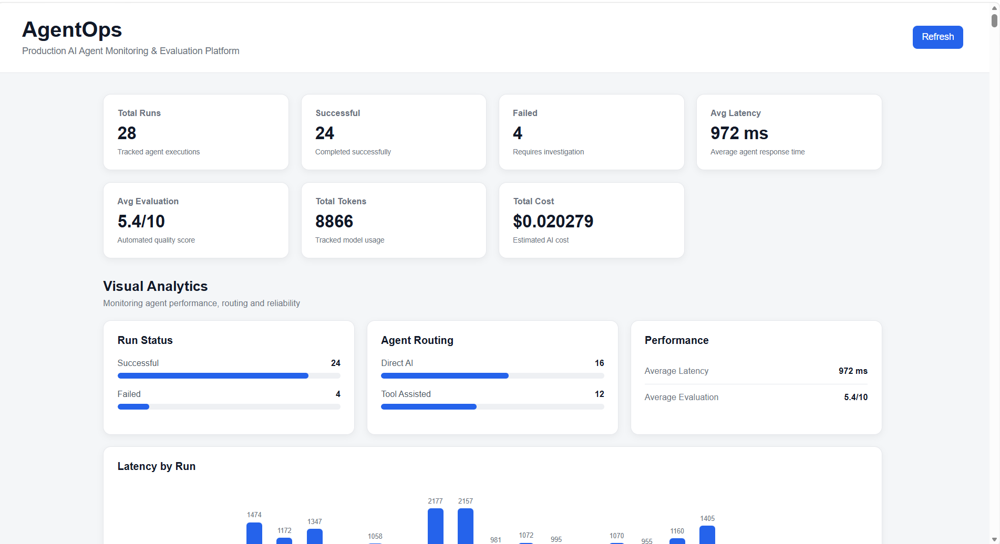

# AgentOps

### Production AI Agent Monitoring & Evaluation Platform

AgentOps is an observability platform designed to monitor, evaluate, and debug AI-agent executions.

Instead of treating an AI application as a simple chatbot, AgentOps provides visibility into each execution — including the prompt, AI response, latency, token usage, estimated cost, tool usage, agent decisions, evaluation scores, and human feedback.

---

## Why AgentOps?

AI agents can produce useful responses, but understanding how well they performed is often difficult.

AgentOps provides a centralized dashboard to answer questions such as:

- What prompts were executed?
- How long did each AI request take?
- How many tokens were used?
- What was the estimated execution cost?
- Which tools were used?
- What decision did the agent make?
- How relevant and high-quality was the response?
- Did a human reviewer approve or reject the result?

The goal is to make AI-agent behavior easier to **monitor, evaluate, and debug**.

---

##  Features

###  AI Execution Monitoring

Track individual AI-agent executions with:

- Prompt
- AI response
- Execution status
- Model used
- Latency
- Token usage
- Estimated cost
- Creation timestamp

###  Agent Decision Tracking

AgentOps records execution decision metadata including:

- Selected route
- Decision reason
- Tools selected

###  Tool Usage Monitoring

Track tool executions including:

- Tool name
- Input
- Output
- Execution status
- Tool latency

Current internal tools include:

- Calculator
- Text Analyzer

###  AI Response Evaluation

Each AI response is automatically evaluated using:

- Relevance score
- Quality score
- Overall score
- Evaluation reason

###  Human Feedback

Developers can manually review AI responses and provide:

- Good
- Needs Improvement
- Optional feedback comment

###  Search & Filtering

Search and filter recorded AI-agent runs directly from the dashboard.

###  Analytics Dashboard

The dashboard provides insights into:

- Total runs
- Successful runs
- Failed runs
- Average latency
- Average evaluation score
- Token usage
- Execution cost

###  Markdown Support

AI responses support Markdown formatting including:

- Headings
- Lists
- Code blocks
- Tables
- Bold and italic text

---

##  System Architecture

```text
                         ┌──────────────────────┐
                         │      React UI        │
                         │      Vite + React    │
                         │                      │
                         │ Dashboard / Analytics│
                         │ Runs / Feedback      │
                         └──────────┬───────────┘
                                    │
                                    │ HTTP
                                    ▼
                         ┌──────────────────────┐
                         │   Node.js Backend    │
                         │      Express         │
                         │                      │
                         │ API + Evaluation     │
                         │ Tool Detection       │
                         │ Logging + Security   │
                         └───────┬────────┬─────┘
                                 │        │
                         HTTP    │        │ MongoDB
                                 │        │
                                 ▼        ▼
                    ┌────────────────┐  ┌────────────────┐
                    │  Python AI     │  │    MongoDB     │
                    │    Service     │  │                │
                    │    FastAPI     │  │ Agent Runs     │
                    │                │  │ Feedback       │
                    │     Groq       │  │ Evaluations    │
                    └───────┬────────┘  └────────────────┘
                            │
                            ▼
                    ┌────────────────┐
                    │    Groq LLM    │
                    │  gpt-oss-20b   │
                    └────────────────┘
```

---

##  Request Flow

```text
User Prompt
     │
     ▼
React Frontend
     │
     ▼
Express Backend
     │
     ├── Detect tools
     ├── Execute tools if required
     ├── Send prompt to AI service
     │
     ▼
FastAPI AI Service
     │
     ▼
Groq LLM
     │
     ▼
AI Response
     │
     ▼
Backend Evaluation
     │
     ├── Relevance
     ├── Quality
     └── Overall Score
     │
     ▼
MongoDB
     │
     ▼
AgentOps Dashboard
```

---

##  Docker Architecture

AgentOps uses Docker Compose to run the backend infrastructure as separate services.

```text
                 AgentOps Docker Network
                         │
       ┌─────────────────┼─────────────────┐
       │                 │                 │
       ▼                 ▼                 ▼
 ┌──────────┐      ┌─────────────┐   ┌─────────────┐
 │ MongoDB  │      │ AI Service  │   │   Backend   │
 │          │      │             │   │             │
 │  27017   │      │  FastAPI    │   │   Express   │
 │          │      │    8000     │   │    5000     │
 └──────────┘      └─────────────┘   └─────────────┘
                                           │
                                           ▼
                                    React Frontend
                                      Port 5173
```

MongoDB uses a persistent Docker volume so stored AgentOps runs survive container recreation.

---

##  Tech Stack

| Layer | Technology |
|---|---|
| Frontend | React, Vite, CSS |
| Markdown | React Markdown, Remark GFM |
| Backend | Node.js, Express.js |
| Database | MongoDB, Mongoose |
| AI Service | Python, FastAPI |
| LLM | Groq — `openai/gpt-oss-20b` |
| HTTP Client | Axios |
| Security | Helmet, Express Rate Limit |
| Containerization | Docker, Docker Compose |
| API Testing | Postman |
| Version Control | Git, GitHub |

---

##  Project Structure

```text
AgentOps/
│
├── backend/
│   ├── agentRun.js
│   ├── db.js
│   ├── logger.js
│   ├── server.js
│   ├── package.json
│   ├── package-lock.json
│   ├── Dockerfile
│   └── .gitignore
│
├── ai-service/
│   ├── main.py
│   ├── requirements.txt
│   ├── Dockerfile
│   └── .gitignore
│
├── frontend/
│   ├── src/
│   │   ├── App.jsx
│   │   ├── App.css
│   │   └── main.jsx
│   ├── package.json
│   ├── package-lock.json
│   └── vite.config.js
│
├── docs/
│   └── screenshots/
│
├── compose.yaml
├── README.md
└── LICENSE
```

---

##  Setup & Installation

### Prerequisites

Make sure the following are installed:

- Node.js
- npm
- Python
- Docker Desktop
- Git
- MongoDB or Docker

### Clone the Repository

```bash
git clone https://github.com/Darshna1308/AgentOps.git
cd AgentOps
```

### Run with Docker Compose

The recommended way to run the backend infrastructure is Docker Compose.

```bash
docker compose up -d --build
```

Check the running containers:

```bash
docker ps
```

Stop the services:

```bash
docker compose down
```

### Service Ports

| Service | Port |
|---|---:|
| React Frontend | 5173 |
| Node.js Backend | 5000 |
| Python AI Service | 8000 |
| MongoDB | 27017 |

---

##  Frontend Setup

```bash
cd frontend
npm install
npm run dev
```

Open the frontend at:

    http://localhost:5173

---

##  Backend Setup

```bash
cd backend
npm install
node server.js
```

Backend API:

    http://localhost:5000

---

##  AI Service Setup

```bash
cd ai-service
python -m venv venv
pip install -r requirements.txt
uvicorn main:app --reload --port 8000
```

AI service:

    http://localhost:8000

---

##  Environment Variables

Environment files containing secrets are excluded from Git.

### Backend

`backend/.env`

```env
PORT=5000
MONGODB_URI=mongodb://agentops-mongo:27017/agentops
AI_SERVICE_URL=http://agentops-ai:8000
```

### AI Service

`ai-service/.env`

```env
GROQ_API_KEY=your_groq_api_key
```

Never commit API keys or other sensitive credentials to GitHub.

---

##  API Endpoints

### Run AI Agent

```http
POST /api/ai/run
```

Example request:

```json
{
  "prompt": "Explain what an AI agent is in simple words."
}
```

The backend sends the request to the AI service, evaluates the response, and stores the execution details in MongoDB.

### Get Agent Runs

```http
GET /api/runs
```

Returns recorded AI-agent executions.

### Submit Human Feedback

```http
POST /api/runs/:id/feedback
```

Example request:

```json
{
  "rating": "good",
  "comment": "The response was clear and relevant."
}
```

Supported ratings:

- `good`
- `needs_improvement`

---

##  Security

AgentOps includes several backend security measures:

- Environment-based secret management
- Helmet security headers
- Restricted CORS
- API rate limiting
- Request validation
- Centralized error handling
- Structured application logging
- No hard-coded API keys
- Secrets excluded from version control

---

##  Testing

The main application flow has been tested across:

- Backend API
- AI service communication
- MongoDB persistence
- Docker Compose networking
- AI execution
- Response evaluation
- Run persistence
- Dashboard rendering
- Search and filtering
- Human feedback
- Markdown responses
- Rate limiting
- Security headers
- CORS configuration

---

##  Dashboard

The AgentOps dashboard provides a centralized view of AI-agent activity.

It includes:

- Execution statistics
- Latency analytics
- Run search
- Run filtering
- Detailed execution information
- Tool execution details
- Agent decision metadata
- AI response evaluation
- Human feedback

### Screenshots

Recommended screenshots can be stored in:

```text
docs/screenshots/
```

For example:

```text
docs/screenshots/dashboard.png
docs/screenshots/run-details.png
docs/screenshots/feedback.png
```

Then displayed in the README using:

```markdown

```

---

##  Project Status

### Completed

- React dashboard
- Node.js/Express backend
- Python/FastAPI AI service
- Groq LLM integration
- MongoDB persistence
- AI execution tracking
- Tool execution tracking
- Agent decision tracking
- Automatic response evaluation
- Human feedback
- Analytics dashboard
- Search and filtering
- Markdown rendering
- Structured logging
- Rate limiting
- Helmet security
- Restricted CORS
- Docker Compose setup
- Persistent MongoDB volume
- GitHub repository

### Planned Improvements

- Authentication and authorization
- Role-based access control
- OpenTelemetry integration
- Additional agent tools
- Advanced evaluation metrics
- CI/CD pipeline
- Production deployment
- Advanced observability
- More detailed analytics

---

##  What AgentOps Demonstrates

This project demonstrates practical experience with:

- Full-stack development
- AI/LLM integration
- AI-agent observability
- REST API development
- Backend architecture
- Database design
- AI response evaluation
- Tool execution tracking
- Docker containerization
- Security practices
- Structured logging
- Monitoring concepts
- React dashboard development

---

##  Author

**Darshna Parihar**

Computer Science Engineering Student  
Chandigarh University

**GitHub:**  
https://github.com/Darshna1308

**Project Repository:**  
https://github.com/Darshna1308/AgentOps

---

## 📄 License

This project is licensed under the MIT License.

See the `LICENSE` file for details.
